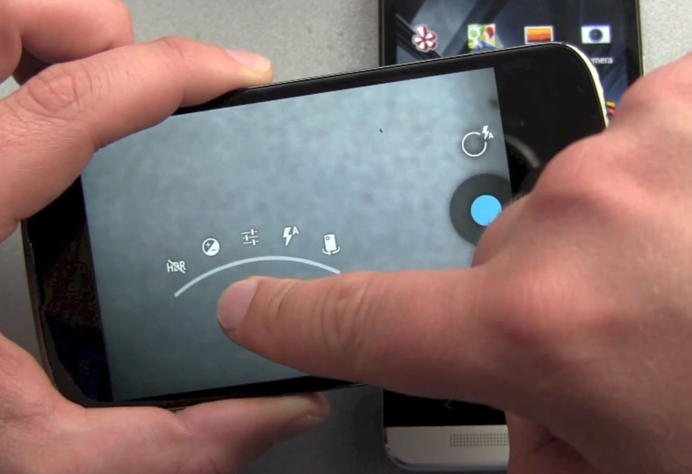

# Client
##Anforderungen - Leistungen
### Anzeige
- Spiel in Vorbereitung, Spiel begonnen, Spiel zuende
- Spielübersicht
	- Infos zu Flaggen und Spielern beider Teams
  - Ist der Spieler frei(offensiv/defensiv) / gefangen / mit Flagge unterwegs / disconnected
	- Steht die Flagge, ist sie gerade gestohlen oder sogar schon verloren?
- Karte
	- Positionen von Spielern und Flaggen (nur eigenes Team, gefangene Gegner, gestohlene&gesichtete Flaggen)
	- Die letzten x Meter, die ein Spieler gelaufen ist als Spur anzeigen
	- Durch Icons Spielerstatus anzeigen
	  - Frei, Gefangen, Mit Flagge, Disconnected
	- Strategische Markierungen

### Eingabe
- Spielerstatus ändern (Frei, Gefangen, Mit/ohne Flagge)
- Strategische Markierungen
  - Gegner/Flagge hier gesehen
	- Linien ziehen/malen -> Multipurpose

#### Eingabemethoden
- Button - davon möglichst wenige, da sie den Kartenausschnitt verkleinern
- Ringmenü, durch Touch aktivierbar
	
## Anforderungen - Hardware/Software
- Smartphone, Tablet, Smartwatch, Smartglasses
- Als WebApp auf diversen Geräten nutzbar
- HTML5 Browser, GPS, Touchdisplay, Internetverbindung

# Server
## Anforderungen - Leistungen
- Sammeln und speichern der Daten von den Clients
- Verteilen der entsprechenden Daten an Clients

### Visuell
- Übersicht über Spielverlauf, Statistiken

## Hard/Software
- Datenbank, PHP/Python Interpreter, ...

#Skizzen
Die Anzeige des Clients könnte (ohne Eingabebuttons) etwa so aussehen:

Ringmenü Bsp.

